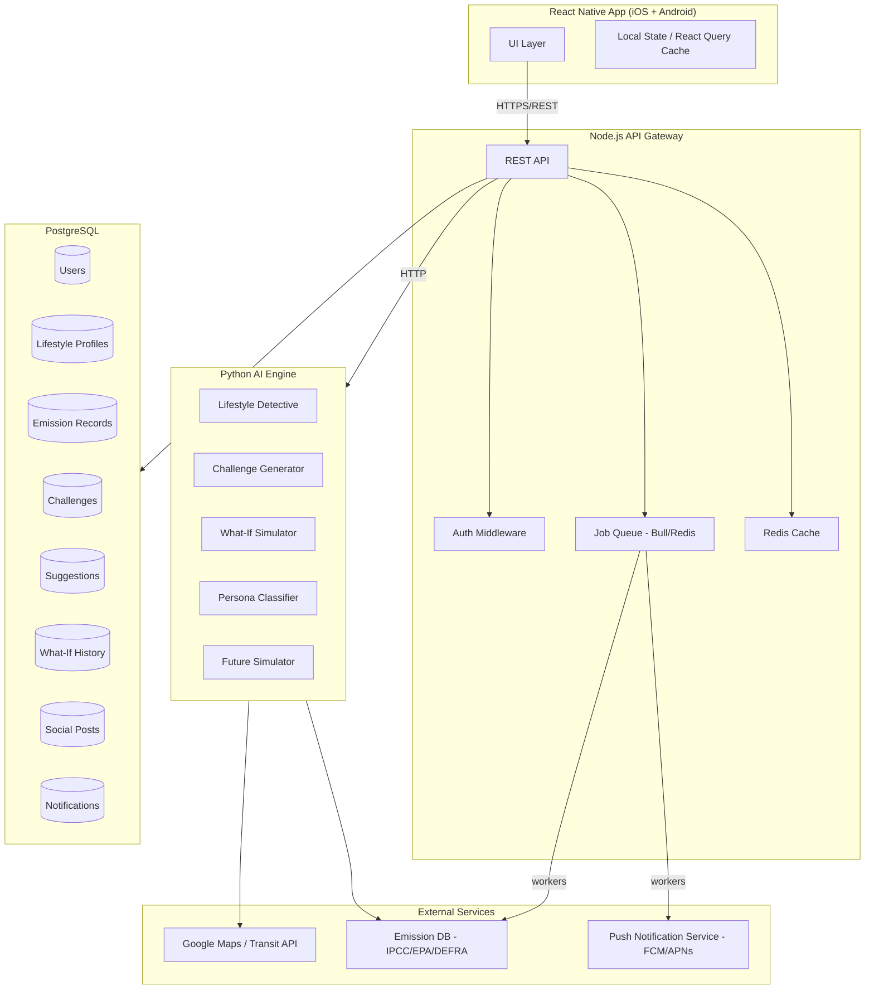
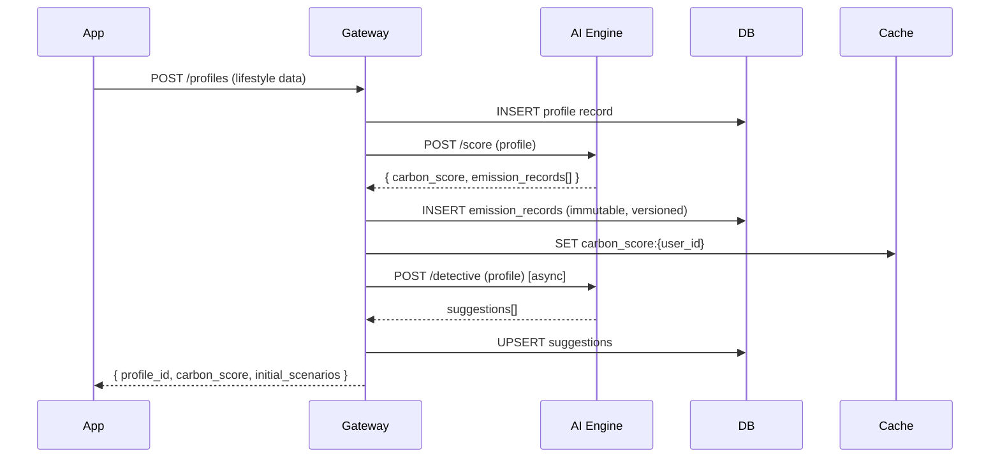

# Design Document — CarbonMirror

## Overview

CarbonMirror is a cross-platform mobile application (React Native, iOS + Android) that transforms abstract carbon data into lived, relatable experiences. The system is organised as a client-mobile tier, a Node.js API gateway, a Python AI engine, a PostgreSQL persistence layer, and a set of third-party integrations (Maps API, carbon emission databases).

The design goal is to keep the mobile client thin — responsible only for rendering and user interaction — while delegating all calculation, AI inference, and data integrity concerns to backend services. This separation lets each tier evolve and scale independently and makes the correctness properties tractable to test.

### Key Design Decisions

- **Backend-calculated emissions**: All CO₂ arithmetic happens on the server using versioned factors. The client never recalculates; it only displays what the API returns. This makes it trivial to audit and re-run calculations when a factor version changes.
- **Event-sourced emission records**: Every emission record is immutable. Updates produce new records rather than overwriting old ones, satisfying the data-integrity requirements and simplifying audit trails.
- **Separate AI Engine service**: The Python AI service encapsulates the recommendation model, challenge generator, what-if simulator, and persona classifier. Node.js calls it over internal HTTP. This isolates Python dependencies from the Node.js runtime and lets the AI service scale independently.
- **Push via background job queue**: All notifications are enqueued as jobs rather than sent inline to requests. This decouples the 24-hour rolling cap logic and priority suppression from application code paths.
- **Carbon Score is a derived view**: The score is never stored as a mutable column; it is computed from the latest emission records and materialised into a cache. When records change, the cache is invalidated and recomputed.

---

## Architecture



### Request Flow — Lifestyle Profile Submission



---

## Components and Interfaces

### Mobile Client (React Native)

**Navigation**: React Navigation v6 with a tab bar housing: Home (Dashboard), Simulator, Avatar, Social Feed, Profile.

**State management**: React Query for server state (profiles, emission records, scenarios, challenges). Zustand for ephemeral UI state (slider position, query input, onboarding step).

**Key screens and their data dependencies**:

| Screen | Primary API Calls |
|---|---|
| Onboarding | `POST /profiles` |
| Dashboard | `GET /carbon-score`, `GET /challenges`, `GET /suggestions` |
| Future Simulator | `GET /scenarios?timeline={1\|5\|10}` |
| Carbon Time Machine | `GET /equivalents` |
| AI Lifestyle Detective | `GET /suggestions` |
| Challenges | `GET /challenges`, `POST /challenges/{id}/complete` |
| Avatar | `GET /avatar-state`, `GET /carbon-score` |
| What-If Scanner | `POST /whatif`, `GET /whatif/history` |
| Social Carbon Swap | `GET /posts`, `POST /posts`, `POST /posts/{id}/adopt` |
| Settings / Notifications | `GET /notification-prefs`, `PUT /notification-prefs` |

**Offline behaviour**: React Query persists the last successful response for all GET routes to AsyncStorage. When offline, the client renders stale data with a banner. Mutations are queued and replayed on reconnect.

---

### Node.js API Gateway

All endpoints are REST under `/api/v1`. Auth is JWT (access token 15 min, refresh token 30 days).

**Core route groups**:

```
POST   /auth/register
POST   /auth/login
POST   /auth/refresh

POST   /profiles               — create lifestyle profile
GET    /profiles/me            — fetch own profile
PATCH  /profiles/me            — update profile fields

GET    /carbon-score           — current score (from cache)
GET    /scenarios?timeline=    — simulator projections
GET    /equivalents            — carbon time machine values

GET    /suggestions            — lifestyle detective results
POST   /suggestions/{id}/acted — mark suggestion acted on

GET    /challenges             — active challenges
POST   /challenges/{id}/complete
POST   /challenges/refresh     — replace one challenge

GET    /avatar-state           — ecosystem state + score delta

POST   /whatif                 — submit what-if query
GET    /whatif/history         — last 20 queries

GET    /posts                  — social feed
POST   /posts                  — publish eco-hack
POST   /posts/{id}/adopt
POST   /posts/{id}/flag

GET    /notification-prefs
PUT    /notification-prefs

GET    /emission-factors/{id}  — factor detail + source
```

**Validation**: `zod` schemas at route entry. Commute distance validated 0–500 km server-side, matching the mobile validation. What-If query capped at 200 characters. Eco-hack description 1–300 characters, CO₂ savings 0.01–500 kg.

**Rate limiting**: 60 req/min per authenticated user via Redis sliding window. What-If route has a tighter limit: 10 req/min.

---

### Python AI Engine

Exposed internally as an HTTP service (FastAPI). Not publicly routable.

**Endpoints**:

```
POST /score              — compute Carbon Score from lifestyle profile
POST /scenarios          — generate three-path projections
POST /detective          — hidden emission discovery
POST /challenges/generate — produce challenge set for persona
POST /whatif             — simulate hypothetical query
POST /classify-persona   — classify user into Student/Hostel/Office/Other
```

**Carbon Score calculation**: Weighted sum of emission factors per category (transport, energy, diet, consumption), normalised against a regional baseline. Score is a percentile in [0, 100] where higher = worse.

**Future Simulator**: Given the baseline annual emission `E_base`, the engine computes:
- Current Path: `E_base × years`
- Better Path: `E_base × reduction_factor_better × years` where reduction_factor_better is sampled from [0.60, 0.80]
- Green Path: `E_base × reduction_factor_green × years` where reduction_factor_green is sampled from [0.20, 0.50]

Both reduction factors are deterministic for a given profile hash — the same profile always produces the same projection.

**Lifestyle Detective**: Uses a rule-based + ML hybrid. The rule layer maps profile attributes to known high-emission patterns (e.g., petrol car + short commute distance → suggest cycling/transit). The ML layer scores suggestions by predicted CO₂ savings using a gradient-boosted model trained on IPCC factor data.

**What-If Simulator**: Uses a slot-filling NLP pipeline (spaCy + custom entity recogniser) to extract {activity, quantity, timeframe} from free text, maps to an emission category, and returns the delta versus the current profile.

**Challenge Generator**: Retrieves the user's persona, recent completions (last 90 days), and current profile, then samples from a challenge template library filtered by persona and recency exclusions, choosing the 3+ challenges with the highest expected CO₂ savings for that user.

---

### Emission Factor Service

A dedicated module within the Node.js gateway (or a side-car if factor dataset grows large) that:

- Caches the current factor file (JSON, versioned by `{source}-{YYYY-MM-DD}`) in Redis with a 7-day TTL
- Fetches fresh factors from IPCC/EPA/DEFRA endpoints on TTL expiry or explicit refresh
- Exposes a `getFactors(source, version?)` function used by both the gateway and the AI engine
- Writes a `staleness_notice` flag when serving from cache after a fetch failure

---

## Data Models

### users

```sql
id            UUID PRIMARY KEY DEFAULT gen_random_uuid()
email         TEXT UNIQUE NOT NULL
password_hash TEXT NOT NULL
created_at    TIMESTAMPTZ NOT NULL DEFAULT now()
updated_at    TIMESTAMPTZ NOT NULL DEFAULT now()
```

### lifestyle_profiles

```sql
id                  UUID PRIMARY KEY DEFAULT gen_random_uuid()
user_id             UUID NOT NULL REFERENCES users(id)
commute_distance_km NUMERIC(6,2) NOT NULL CHECK (commute_distance_km BETWEEN 0 AND 500)
transport_mode      TEXT NOT NULL
energy_source       TEXT NOT NULL
dietary_pattern     TEXT NOT NULL
consumption_level   TEXT NOT NULL
persona             TEXT CHECK (persona IN ('Student','Hostel Resident','Office Worker','Other'))
created_at          TIMESTAMPTZ NOT NULL DEFAULT now()
version             INT NOT NULL DEFAULT 1
is_current          BOOLEAN NOT NULL DEFAULT TRUE
```

`is_current = TRUE` identifies the active profile. Updates insert a new row and set `is_current = FALSE` on the previous row. This preserves full history for audit.

### emission_records

```sql
id                UUID PRIMARY KEY DEFAULT gen_random_uuid()
user_id           UUID NOT NULL REFERENCES users(id)
profile_id        UUID NOT NULL REFERENCES lifestyle_profiles(id)
category          TEXT NOT NULL
input_values      JSONB NOT NULL
co2_kg            NUMERIC(10,1) NOT NULL
factor_source     TEXT NOT NULL
factor_version    TEXT NOT NULL
recorded_at       TIMESTAMPTZ NOT NULL DEFAULT now()
```

This record is immutable after insert. `input_values` stores the raw profile fields so calculations can be audited and replayed.

### carbon_score_cache

```sql
user_id       UUID PRIMARY KEY REFERENCES users(id)
score         NUMERIC(5,2) NOT NULL
percentile    NUMERIC(5,2) NOT NULL
calculated_at TIMESTAMPTZ NOT NULL
profile_id    UUID NOT NULL REFERENCES lifestyle_profiles(id)
```

Invalidated and recomputed whenever a new emission record is inserted for the user.

### scenarios

```sql
id            UUID PRIMARY KEY DEFAULT gen_random_uuid()
user_id       UUID NOT NULL REFERENCES users(id)
profile_id    UUID NOT NULL REFERENCES lifestyle_profiles(id)
timeline_yr   SMALLINT NOT NULL CHECK (timeline_yr IN (1, 5, 10))
path          TEXT NOT NULL CHECK (path IN ('current','better','green'))
co2_kg        NUMERIC(12,1) NOT NULL
cost_local    NUMERIC(12,2) NOT NULL
trees_offset  INT NOT NULL
energy_kwh    NUMERIC(12,1) NOT NULL
assumes_uncommitted_changes BOOLEAN NOT NULL DEFAULT FALSE
computed_at   TIMESTAMPTZ NOT NULL DEFAULT now()
```

### suggestions

```sql
id                  UUID PRIMARY KEY DEFAULT gen_random_uuid()
user_id             UUID NOT NULL REFERENCES users(id)
profile_id          UUID NOT NULL REFERENCES lifestyle_profiles(id)
emission_source     TEXT NOT NULL
profile_attribute   TEXT NOT NULL
alternative         TEXT NOT NULL
monthly_co2_kg      NUMERIC(6,1) NOT NULL
time_cost_min_week  INT NOT NULL
rank                INT NOT NULL
acted_at            TIMESTAMPTZ
created_at          TIMESTAMPTZ NOT NULL DEFAULT now()
```

### challenges

```sql
id              UUID PRIMARY KEY DEFAULT gen_random_uuid()
user_id         UUID NOT NULL REFERENCES users(id)
template_id     TEXT NOT NULL
description     TEXT NOT NULL
co2_savings_kg  NUMERIC(6,2) NOT NULL
difficulty      TEXT NOT NULL CHECK (difficulty IN ('Easy','Medium','Hard'))
reward_points   INT NOT NULL CHECK (reward_points BETWEEN 1 AND 500)
status          TEXT NOT NULL DEFAULT 'active' CHECK (status IN ('active','complete','removed'))
completed_at    TIMESTAMPTZ
created_at      TIMESTAMPTZ NOT NULL DEFAULT now()
```

### what_if_queries

```sql
id              UUID PRIMARY KEY DEFAULT gen_random_uuid()
user_id         UUID NOT NULL REFERENCES users(id)
query_text      TEXT NOT NULL
activity_category TEXT
co2_monthly_kg  NUMERIC(6,1)
cost_monthly    NUMERIC(8,2)
breakeven_months INT
parsed_ok       BOOLEAN NOT NULL DEFAULT FALSE
submitted_at    TIMESTAMPTZ NOT NULL DEFAULT now()
```

Kept to the most recent 20 rows per user; a trigger deletes the oldest when count exceeds 20.

### social_posts

```sql
id              UUID PRIMARY KEY DEFAULT gen_random_uuid()
user_id         UUID NOT NULL REFERENCES users(id)
description     TEXT NOT NULL CHECK (char_length(description) BETWEEN 1 AND 300)
activity_category TEXT NOT NULL
co2_savings_kg  NUMERIC(6,2) NOT NULL CHECK (co2_savings_kg BETWEEN 0.01 AND 500)
adoption_count  INT NOT NULL DEFAULT 0
flag_count      INT NOT NULL DEFAULT 0
published_at    TIMESTAMPTZ NOT NULL DEFAULT now()
```

Posts where `flag_count >= 6` are excluded from feed queries via a view.

### post_adoptions

```sql
post_id    UUID NOT NULL REFERENCES social_posts(id)
user_id    UUID NOT NULL REFERENCES users(id)
adopted_at TIMESTAMPTZ NOT NULL DEFAULT now()
PRIMARY KEY (post_id, user_id)
```

Composite PK prevents duplicate adoptions.

### notification_log

```sql
id          UUID PRIMARY KEY DEFAULT gen_random_uuid()
user_id     UUID NOT NULL REFERENCES users(id)
type        TEXT NOT NULL CHECK (type IN ('weekly_summary','challenge','progress','social','re_engagement'))
priority    INT NOT NULL
sent_at     TIMESTAMPTZ NOT NULL DEFAULT now()
suppressed  BOOLEAN NOT NULL DEFAULT FALSE
```

Used to enforce the rolling 24-hour cap of 3 and the 7-day re-engagement logic.

### emission_factor_versions

```sql
source      TEXT NOT NULL
version     TEXT NOT NULL
fetched_at  TIMESTAMPTZ NOT NULL
factors     JSONB NOT NULL
is_current  BOOLEAN NOT NULL DEFAULT TRUE
PRIMARY KEY (source, version)
```

---

## Correctness Properties

*A property is a characteristic or behavior that should hold true across all valid executions of a system — essentially, a formal statement about what the system should do. Properties serve as the bridge between human-readable specifications and machine-verifiable correctness guarantees.*

### Property 1: Carbon Equivalent Round-Trip

*For any* emission record value `v > 0` and any conversion factor `f > 0`, converting `v` to a carbon equivalent (`v / f`) and back (`result × f`) SHALL produce a value within 1% of `v`.

**Validates: Requirements 3.5**

---

### Property 2: Emission Record Storage Round-Trip

*For any* emission record inserted into the database, retrieving it by its primary key SHALL return an identical record with no data loss or precision change in `co2_kg`, `input_values`, `factor_version`, `factor_source`, and `recorded_at`; the `factor_source` and `factor_version` fields SHALL both be non-null and non-empty.

**Validates: Requirements 9.1, 9.3, 9.6**

---

### Property 3: Input Validation Accepts and Rejects Correct Ranges

*For any* numeric commute distance input value strictly outside [0, 500], the profile validation function SHALL reject it; *for any* value in [0, 500], it SHALL be accepted. *For any* What-If query string with length greater than 200 characters, the input SHALL be rejected; strings of length ≤ 200 SHALL be accepted.

**Validates: Requirements 1.2, 7.1**

---

### Property 4: Scenario Reduction Bounds and Structural Completeness

*For any* valid lifestyle profile and any timeline value in {1, 5, 10}, the simulation engine SHALL return all three paths (Current, Better, Green) each containing exactly four metrics (`co2_kg`, `cost_local`, `trees_offset`, `energy_kwh`); the Better Path total emission SHALL be 20–40% lower than Current Path for the same timeline; the Green Path SHALL be 50–80% lower than Current Path for the same timeline.

**Validates: Requirements 2.1, 2.2, 2.5, 2.6**

---

### Property 5: Challenge Reward Points Bounds and Minimum Active Count

*For any* user persona and lifestyle profile, the challenge generator SHALL produce at least 3 challenges; every generated challenge SHALL have a `reward_points` value that is an integer in the closed interval [1, 500].

**Validates: Requirements 5.2**

---

### Property 6: No Duplicate Challenges Within 90 Days

*For any* user, no challenge with a `template_id` matching a challenge the user completed in the last 90 days SHALL appear in that user's active challenge set.

**Validates: Requirements 5.6**

---

### Property 7: Social Post CO₂ Savings Validation Bounds

*For any* eco-hack submission, the post SHALL be accepted if and only if `co2_savings_kg` is in [0.01, 500], the description length is in [1, 300] characters, and the activity category matches a recognized category in the Emission Database.

**Validates: Requirements 8.1, 8.6**

---

### Property 8: Post Adoption Idempotency

*For any* user and post pair, adopting the same post a second time SHALL leave the adoption count unchanged and SHALL not add duplicate CO₂ savings to the user's profile; the adoption count SHALL increase by exactly 1 on the first adoption.

**Validates: Requirements 8.4, 8.7**

---

### Property 9: Notification Cap and Opt-Out Suppression

*For any* user and any rolling 24-hour window, the count of non-exempt (non-challenge) push notifications sent SHALL not exceed 3; when suppression is required, the lowest-priority notification (social feed first, then progress updates) SHALL be suppressed. *For any* user who has opted out of all notifications, no non-challenge notification SHALL be dispatched to their device.

**Validates: Requirements 10.4, 10.5**

---

### Property 10: Suggestions Schema, Ranking, and Trimming

*For any* profile that produces suggestions, every suggestion SHALL contain the fields `profile_attribute`, `alternative`, `monthly_co2_kg` (rounded to one decimal), and `time_cost_min_week` (integer). *For any* profile that produces 5 or more suggestions, the returned list SHALL contain exactly 5 items ordered by `monthly_co2_kg` descending. *For any* profile that produces 1–4 suggestions, all shall be returned ordered by `monthly_co2_kg` descending.

**Validates: Requirements 4.2, 4.4, 4.5**

---

### Property 11: What-If Query History Bounded at 20

*For any* user with more than 20 what-if queries, the history endpoint SHALL return exactly 20 records — the most recent 20 — and not more.

**Validates: Requirements 7.5**

---

### Property 12: Avatar State Machine Correctness and Regression Cap

*For any* Carbon Score percentile value in [0, 100], the Avatar state SHALL be 'Polluted Forest' when the percentile is above 70, 'Grassland' when between 30 and 70 inclusive, and 'Thriving Forest' when below 30. *For any* sequence of Carbon Score changes within a rolling 7-day window that would cause multiple ecosystem state regressions, the Avatar state SHALL regress by at most one ecosystem state per window. *For any* avatar state transition, the contextual message displayed SHALL be at most 140 characters.

**Validates: Requirements 6.1, 6.3, 6.5**

---

### Property 13: CO₂ Value Precision

*For any* CO₂ value displayed on a user-facing screen, the formatted string SHALL match the pattern `\d+\.\d{1}` — exactly one decimal place in kilograms.

**Validates: Requirements 9.5**

---

### Property 14: Flagged Post Exclusion from Feed

*For any* Social Carbon Swap feed query, the results SHALL not include any post whose `flag_count` is 6 or greater.

**Validates: Requirements 8.5**

---

### Property 15: Community CO₂ Aggregate Accuracy

*For any* set of confirmed adoptions, the community-wide cumulative CO₂ saved displayed in the feed header SHALL equal the sum of `co2_savings_kg` values from all user-confirmed adoptions and no other source.

**Validates: Requirements 8.3**

---

### Property 16: Persona Classification Completeness

*For any* valid completed lifestyle profile, the persona classifier SHALL return a value that is one of exactly four valid values: 'Student', 'Hostel Resident', 'Office Worker', or 'Other'.

**Validates: Requirements 5.1**

---

## Error Handling

### Profile Submission Failures

- If the database write fails, the gateway returns HTTP 503 with a retryable error body `{ "error": "profile_save_failed", "retryable": true }`. The client retains all form state and shows a retry banner.
- If the AI Engine times out (>3 s for score, >10 s for detective), the gateway returns a partial success: `{ "carbon_score": null, "error": "score_timeout" }`. The client shows the dashboard with a "Calculating…" placeholder and polls `GET /carbon-score` every 5 seconds until a score is available.

### Emission Database Unavailability

- On fetch failure, the gateway serves the last cached factors and sets `staleness_notice: true` on all responses that use those factors.
- A background job retries the fetch every 30 minutes.
- When a fresh fetch succeeds, all cached emission records computed with stale factors are queued for recalculation within 24 hours, and a notification is enqueued per affected user.

### What-If Parse Failure

- When slot-filling cannot extract a valid `{activity, quantity, timeframe}` triple, the AI Engine returns `{ "parsed_ok": false, "missing_slots": ["quantity"] }`.
- The gateway maps this to a 422 response with a user-readable message identifying exactly which slots are missing.
- The failed query is still stored in `what_if_queries` with `parsed_ok = false` so history is consistent.

### Maps API Failure (Lifestyle Detective)

- If the Maps API call fails, the transit route duration field is omitted from the suggestion, and a note `"transit_time": null, "transit_time_note": "Route data temporarily unavailable"` is included.
- The suggestion is still surfaced; only the duration annotation is missing.

### Notification Suppression

- Before every push dispatch, the job worker queries `notification_log` for the rolling 24-hour window.
- If cap would be exceeded for non-exempt types, the job marks the notification as `suppressed = true` in the log and does not invoke the push provider.
- Challenge notifications bypass this check entirely.

### Validation Errors

All validation errors follow a consistent envelope:

```json
{
  "error": "validation_error",
  "fields": [
    { "field": "commute_distance_km", "message": "Must be between 0 and 500" }
  ]
}
```

The client maps field names to the corresponding form controls and displays inline messages.

---

## Testing Strategy

CarbonMirror uses a dual testing approach: unit/property-based tests cover logic correctness, and integration tests cover external service wiring, timing SLAs, and end-to-end flows. PBT is appropriate here because the app has many pure functions (emission calculation, validation, sorting, formatting, simulation math) with large input spaces where edge cases matter.

### Property-Based Tests (fast-check for Node.js / Hypothesis for Python)

Property tests run a minimum of 100 iterations per property. Each test is tagged in source:
`// Feature: carbon-mirror, Property {N}: {property_text}`

**P1 — Carbon Equivalent Round-Trip** (Node.js, fast-check)
Generate `(v: float in (0, 1e6], f: float in (0.001, 1e4])`. Apply `roundTrip(v, f) = (v / f) * f`. Assert `|roundTrip(v, f) - v| / v < 0.01`.
`// Feature: carbon-mirror, Property 1: Carbon Equivalent Round-Trip`

**P2 — Emission Record Storage Round-Trip** (Node.js, fast-check)
Generate a random valid emission record payload (random category, co2_kg, factor fields). Insert via repository layer. Retrieve by ID. Deep-equal assert on all fields; assert `factor_source` and `factor_version` are non-null and non-empty.
`// Feature: carbon-mirror, Property 2: Emission Record Storage Round-Trip`

**P3 — Input Validation Accepts and Rejects Correct Ranges** (Node.js, fast-check)
(a) Generate `x: float`. Assert `validateCommute(x) === (x >= 0 && x <= 500)`.
(b) Generate `s: string`. Assert `validateWhatIfQuery(s)` is accepted iff `s.length <= 200`.
`// Feature: carbon-mirror, Property 3: Input Validation Accepts and Rejects Correct Ranges`

**P4 — Scenario Reduction Bounds and Structural Completeness** (Python, Hypothesis)
Generate a random lifestyle profile dict with valid field values. For each timeline in {1, 5, 10}, call `compute_scenarios(profile, timeline)`. Assert: all three paths are present; each has `co2_kg`, `cost_local`, `trees_offset`, `energy_kwh`; `better_path.co2_kg` is in [0.60×, 0.80×] of `current_path.co2_kg`; `green_path.co2_kg` is in [0.20×, 0.50×] of `current_path.co2_kg`.
`# Feature: carbon-mirror, Property 4: Scenario Reduction Bounds and Structural Completeness`

**P5 — Challenge Reward Points Bounds and Minimum Active Count** (Python, Hypothesis)
Generate a random user persona (one of the four valid values) and a lifestyle profile. Call `generate_challenges(profile, persona)`. Assert `len(challenges) >= 3` and for all challenges `1 <= challenge.reward_points <= 500`.
`# Feature: carbon-mirror, Property 5: Challenge Reward Points Bounds and Minimum Active Count`

**P6 — No Duplicate Challenges Within 90 Days** (Python, Hypothesis)
Generate a random set of recently completed `template_id`s (up to 50) and call `generate_challenges(profile, persona, recently_completed)`. Assert none of the returned challenges have a `template_id` in the completed set.
`# Feature: carbon-mirror, Property 6: No Duplicate Challenges Within 90 Days`

**P7 — Social Post CO₂ Savings Validation Bounds** (Node.js, fast-check)
Generate `(description: string, category: string, savings: float)`. Assert `validatePost(...)` accepts iff `savings in [0.01, 500]` AND `description.length in [1, 300]` AND `category in VALID_CATEGORIES`. Test each constraint independently to ensure all three are enforced.
`// Feature: carbon-mirror, Property 7: Social Post CO₂ Savings Validation Bounds`

**P8 — Post Adoption Idempotency** (Node.js, fast-check)
Generate a user ID and post ID. Call `adoptPost(userId, postId)` once — assert adoption count incremented by 1 and CO₂ savings added to profile. Call `adoptPost(userId, postId)` again — assert adoption count unchanged and no duplicate CO₂ savings.
`// Feature: carbon-mirror, Property 8: Post Adoption Idempotency`

**P9 — Notification Cap and Opt-Out Suppression** (Node.js, fast-check)
(a) Generate a sequence of 1–10 non-exempt notification jobs and 0–5 challenge jobs for a user in a 24-hour window. Run through the notification dispatcher. Assert total non-exempt dispatched ≤ 3; all challenge notifications always dispatched; suppressed notifications are the lowest-priority ones.
(b) Set user preference to opt-out. Generate 1–5 non-challenge notification jobs. Assert none are dispatched.
`// Feature: carbon-mirror, Property 9: Notification Cap and Opt-Out Suppression`

**P10 — Suggestions Schema, Ranking, and Trimming** (Python, Hypothesis)
Generate a list of 1–20 suggestion objects with random `monthly_co2_kg` values and all required fields. Call `rank_and_trim(suggestions)`. For lists ≥ 5: assert length is exactly 5, sorted descending. For lists 1–4: assert length unchanged, sorted descending. Assert every suggestion has `profile_attribute`, `alternative`, `monthly_co2_kg` (one decimal), and `time_cost_min_week` (int).
`# Feature: carbon-mirror, Property 10: Suggestions Schema, Ranking, and Trimming`

**P11 — What-If Query History Bounded at 20** (Node.js, fast-check)
Generate `n: integer in [21, 50]` what-if query payloads for a single user. Insert all. Call `getWhatIfHistory(userId)`. Assert returned array length is exactly 20 and contains the 20 most recently inserted queries.
`// Feature: carbon-mirror, Property 11: What-If Query History Bounded at 20`

**P12 — Avatar State Machine Correctness and Regression Cap** (Node.js, fast-check)
(a) Generate `percentile: float in [0, 100]`. Call `getAvatarState(percentile)`. Assert: 'Polluted Forest' if percentile > 70; 'Grassland' if 30 ≤ percentile ≤ 70; 'Thriving Forest' if percentile < 30.
(b) Generate a sequence of score changes over a 7-day window that triggers ≥ 2 state regressions. Assert the Avatar state decrements by at most 1 within that window.
(c) Generate a random state transition. Assert the contextual message length ≤ 140 characters.
`// Feature: carbon-mirror, Property 12: Avatar State Machine Correctness and Regression Cap`

**P13 — CO₂ Value Precision** (Node.js, fast-check)
Generate `co2_kg: float in [0, 1e7]`. Assert `formatCO2(co2_kg)` matches the regex `/^\d+\.\d{1}$/`.
`// Feature: carbon-mirror, Property 13: CO₂ Value Precision`

**P14 — Flagged Post Exclusion from Feed** (Node.js, fast-check)
Generate a list of posts with random `flag_count` values in [0, 10]. Call `getFeedPosts(posts)`. Assert none of the returned posts have `flag_count >= 6`.
`// Feature: carbon-mirror, Property 14: Flagged Post Exclusion from Feed`

**P15 — Community CO₂ Aggregate Accuracy** (Node.js, fast-check)
Generate a random set of confirmed adoption records each with a `co2_savings_kg` value. Assert `getCommunityTotal(adoptions)` equals the sum of all `co2_savings_kg` values in the input set.
`// Feature: carbon-mirror, Property 15: Community CO₂ Aggregate Accuracy`

**P16 — Persona Classification Completeness** (Python, Hypothesis)
Generate a random valid lifestyle profile dict. Call `classify_persona(profile)`. Assert the result is one of `{'Student', 'Hostel Resident', 'Office Worker', 'Other'}` and never null or empty.
`# Feature: carbon-mirror, Property 16: Persona Classification Completeness`

---

### Unit Tests (Jest for Node.js, Pytest for Python)

Unit tests focus on specific examples, boundary conditions, and integration points not covered by PBT:

- Commute distance boundary values: -1, 0, 250, 500, 501 (exact boundary pass/fail)
- What-If slot extractor: valid `{activity, quantity, timeframe}` triple, one slot missing, all slots missing
- `what_if_queries` history trim trigger: insert exactly 21 rows, verify the oldest is deleted
- Post validation: description exactly 1 char, 300 chars, 301 chars; CO₂ savings 0.005, 0.01, 500, 500.01
- Avatar transition message: assert message present and ≤ 140 chars for each state change direction
- Staleness notice: assert `staleness_notice: true` on responses using cached factors
- Re-engagement notification: assert not counted toward rolling 24-hour cap

### Integration Tests

- Full onboarding → Carbon Score calculation → scenario generation (against test DB + mock AI engine)
- Profile update → score cache invalidation → scenario recomputation within 5 s
- What-If query → "Apply this change" → full profile recalculation → updated scenarios
- Social post publish → feed query → post appears within 30 s (real-time visibility)
- Challenge complete → reward points credited → cumulative CO₂ updated on profile
- Emission factor fetch failure → staleness notice served → factor refresh → notice removed within 1 hour
- New challenge generated → push notification job enqueued within 1 hour
- Maps API integration: transit route duration returned for commute suggestions
- 7-day inactivity + avatar state change → re-engagement notification dispatched

### Smoke Tests

- Node.js API server starts and `GET /health` returns HTTP 200
- Python AI Engine starts and `GET /health` returns HTTP 200
- PostgreSQL connection pool connects and executes a test query
- Redis connects, sets a key, retrieves it, and deletes it
- FCM/APNs credentials validated via dry-run ping

### React Native UI Tests (Detox + React Native Testing Library)

- Onboarding: all 5 fields present; empty field blocks progression; invalid distance shows inline error
- Simulator: slider drag updates all 12 metric values (3 paths × 4 metrics) within 500 ms
- Carbon Time Machine: tapping an equivalent shows tooltip with factor and source
- Avatar screen: correct ecosystem state label and CO₂-to-next-state value rendered
- Challenge completion: celebratory animation plays for 2–4 s then reverts
- What-If history: scrollable list shows at most 20 items
- Notification preferences: frequency and type toggles persist across screen navigation

